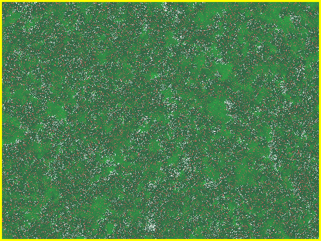
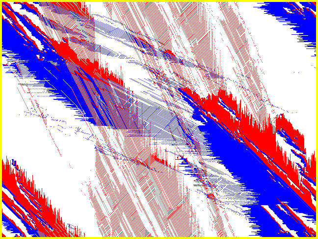
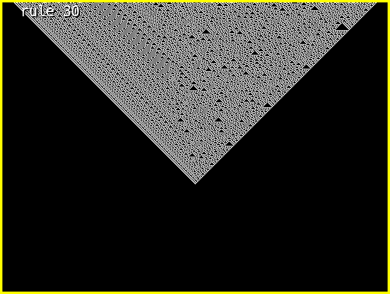
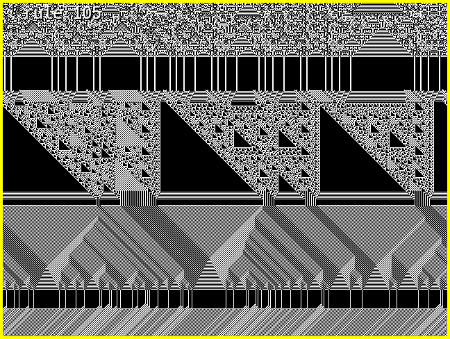

# CA-Toy
Its sort of a framework for cellular automatas written in C, using SDL.

## Building
make

dependencies: SDL2, SDL2-image, SDL2-ttf

## Command Line Args
 * --width (default 640)
 * --height (default 480)
 * --scale (default 1)

## Controls
 * ESC to open application menu
 * m to open CA specific menu
 * r to reset
 * wasd, hjkl or arrows for menu navigation
 * space to play/pause

 ## Current CA's
 1. Predator Prey
 
 2. Biham–Middleton–Levine traffic model (https://en.wikipedia.org/wiki/Biham%E2%80%93Middleton%E2%80%93Levine_traffic_model)
 
 3. Elementary CA's (https://en.wikipedia.org/wiki/Elementary_cellular_automaton) with single on pixel start
 
 4. Elementary CA's with randomized start (changing between them is fun)
 

## CA ideas
* Elementary CA's++: resulting state also depends on previous value of the pixel (4 bits), or previous neighbourhood (6 bits), or on a wider neighbourhood (5 bits)
* elementary random walker - just randomly change the rule periodically (and re randomize when it hits a crap one like rule 0)
* Life, duh, it's more that I dont yet support edit, save and load but there's no reason I couldn't I suppose...
* Bushfires 
* https://en.wikipedia.org/wiki/Cyclic_cellular_automaton
* Some evolutionary game theory sims like hawks and doves https://en.wikipedia.org/wiki/Evolutionary_game_theory
* There's another traffic CA called the Nagel–Schreckenberg model I think
* langton's ant
* something that simulates the rise and fall of empires would be awesome...

## Architecture
 * main is for dependencies and CLAP
 * application is sort of the main struct for the application, duh, anything that would normally have been global soup before goes here
 * 'gef' is a made up name for the SDL wrapper
 * CA's are pretty modular, they are in the rules subdirectory, they have to satisfy the rule 'interface' from application.h
 * the rules array in application.c is where they are registered. Should this be a member of application? maybe

 ## Todos
  * plotting populations over time would be nice (since PP is described by some kind of differential equation thing which has like sinusoidal or constant or exponential solutions, it would be cool to see that in action)